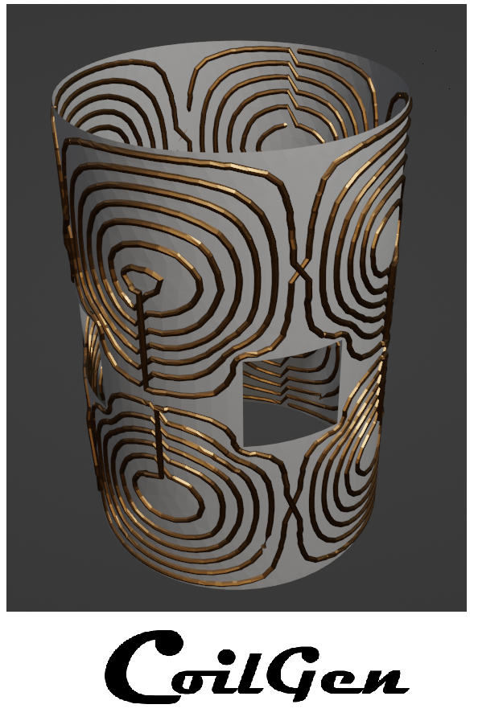
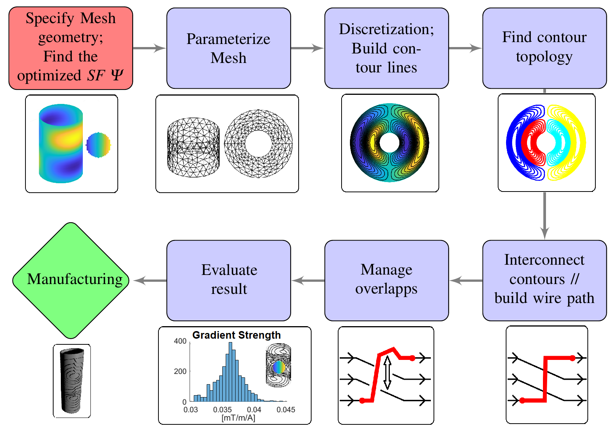

 

<!-- ABOUT THE PROJECT -->

The CoilGen Project is a community-based tool for the generation of coil Layouts within the MRI/NMR environment. It is based on a boundary element method and generates an interconnected non-overlapping wire-tracks on 3D support structures. The focus of this work is post processing.

The user must specify a target field (e.g., bz(x,y,z)=y for a constant gradient in the y-direction) and a surface mesh geometry (e.g., a cylinder defined in an .stl file). The code then generates a coil layout in the form of a non-overlapping, interconnected wire trace to achieve the desired field.

## pyCoilGen: A Python Implementation
The author has supported the creation of **pyCoilGen**, a translation of this CoilGen Project to Python. The code is available on [GitHub](https://github.com/kev-m/pyCoilGen) and
documentation is available on [ReadTheDocs](https://pycoilgen.readthedocs.io/).

A full description is given in the following publication: https://onlinelibrary.wiley.com/doi/10.1002/mrm.29294

<!-- GETTING STARTED -->
## Getting Started

Check the documentation to get started

### Installation

1. Download and extract the file of the CoilGen repository
2. Run one of the examples in the folder "Examples"

The project requires MATLAB and optionally FastHenry2 for calculation of the coil inductance.  The MATLAB version should not be older than 2020A.

### Algorithm overview

<!-- LICENSE -->
## License

 See `LICENSE.txt` for more information.

(<a href="#top">back to top</a>)

<!-- CONTACT -->
## Contact

Philipp Amrein, Github User: Philipp-MR 

Project Link: [https://github.com/Philipp-MR/CoilGen]

(<a href="#top">back to top</a>)

## Citation

For citation of this work, please refer to the following publication:
https://onlinelibrary.wiley.com/doi/10.1002/mrm.29294
https://doi.org/10.1002/mrm.29294

(<a href="#top">back to top</a>)

